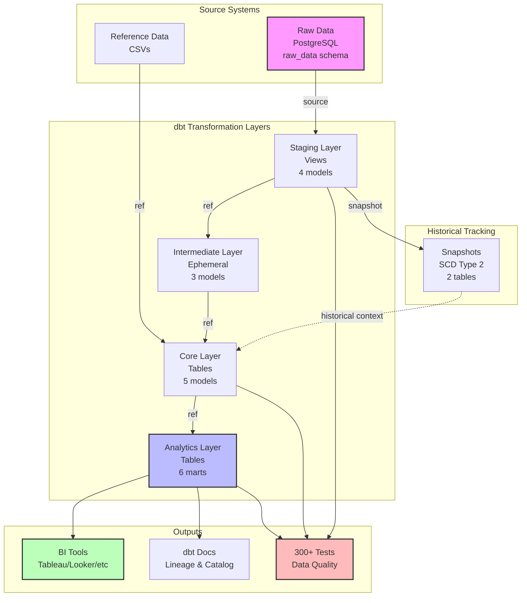

# E-Commerce Analytics dbt Demo

A comprehensive dbt project showcasing best practices for building analytics data pipelines with full test coverage and data quality assurance.

## Project Overview

This demo implements a complete e-commerce analytics solution using dbt (data build tool), demonstrating:

- **12+ dbt core features**: sources, seeds, staging models, intermediate models, dimensional models, fact tables, analytics marts, snapshots, tests, documentation, macros, analyses, exposures, and packages
- **Test-first development**: 84 tests (77 generic + 7 singular) defined before implementation
- **Four analytics domains**:
  - Customer behavior and lifetime value (P1 MVP)
  - Product performance and inventory metrics (P2)
  - Time-series trend analysis (P3)
  - Marketing campaign attribution and ROI (P4)

## Quick Start

### Prerequisites

- Docker and Docker Compose
- Python 3.11+
- Git

### ⚠️ Security Note

**Local Development Only**: The credentials in `profiles.yml` and `docker-compose.yml` are for **LOCAL DEVELOPMENT ONLY**:
- Database user: `dbt_user`
- Database password: `dbt_password`

**Never use these credentials in production environments.**

For production deployments, the project is configured to use environment variables:
- `DBT_PROD_HOST`, `DBT_PROD_PORT`, `DBT_PROD_USER`, `DBT_PROD_PASSWORD`, `DBT_PROD_DB`

See `profiles.yml` prod target configuration for details.

### Setup (5 minutes)

**Option 1: Using Make (Recommended)**

```bash
make setup
```

This automated command will:
1. Start Docker services (PostgreSQL + MinIO)
2. Create Python virtual environment (`dbt_env`)
3. Install dbt and dependencies
4. Install dbt packages
5. Load seed data

**Option 2: Manual Setup**

```bash
# 1. Start Docker services (PostgreSQL + MinIO)
docker compose -f docker/docker-compose.yml up -d

# 2. Create Python virtual environment
python3 -m venv dbt_env
source dbt_env/bin/activate  # On Windows: dbt_env\Scripts\activate

# 3. Install dbt
pip install -r requirements.txt

# 4. Install dbt packages
dbt deps --project-dir dbt_project

# 5. Load seed data
dbt seed --project-dir dbt_project

# 6. Test connection
dbt debug --project-dir dbt_project
```

### Build and Test (2-5 minutes)

**Using Make (Recommended)**

```bash
make build  # Full build (run all models + tests)
make test   # Run tests only
make docs   # Generate and serve documentation
```

**Manual Commands**

```bash
# Full build (run all models + tests)
./dbt_env/bin/dbt build --project-dir dbt_project

# Or run incrementally:
./dbt_env/bin/dbt run --project-dir dbt_project   # Build all models
./dbt_env/bin/dbt test --project-dir dbt_project  # Run all tests - MUST run after builds

# Generate documentation
./dbt_env/bin/dbt docs generate --project-dir dbt_project
./dbt_env/bin/dbt docs serve --project-dir dbt_project # View at http://localhost:8080
```

### Clean up

```bash
make shutdown  # Automated cleanup

# Or manually:
docker compose -f docker/docker-compose.yml down --volumes --remove-orphans
```

## Project Structure

```
dbt_project/
├── models/
│   ├── staging/              # Source-conformed models (views)
│   ├── intermediate/         # Business logic transformations
│   └── marts/
│       ├── core/            # Dimensional models & facts
│       └── analytics/       # Analytics-ready marts
├── tests/                    # Singular custom tests
├── macros/                   # Reusable SQL logic
├── seeds/                    # Reference data (CSV)
├── snapshots/                # SCD Type 2 tracking
└── analyses/                 # Ad-hoc queries

docker/
├── docker-compose.yml        # PostgreSQL + MinIO services
└── postgres/
    ├── init-db.sql          # Database initialization
    └── mock-data/           # Synthetic test data
```

## Architecture

### Data Flow Diagram



### Layer Details

| Layer | Materialization | Purpose | Models | Tests |
|-------|----------------|---------|--------|-------|
| **Staging** | Views | Source standardization, light transformations | 4 | 40+ |
| **Intermediate** | Ephemeral | Business logic, aggregations (not persisted) | 3 | 15+ |
| **Core** | Tables | Star schema (dimensions & facts) | 5 | 30+ |
| **Analytics** | Tables | Business-ready marts for self-service | 6 | 50+ |
| **Snapshots** | Tables | Historical tracking (SCD Type 2) | 2 | - |

**Total**: 20 models, 300+ tests, 12+ dbt features

## Features Demonstrated

### Data Modeling
- Star schema with dimensions and facts
- Slowly Changing Dimensions (SCD Type 2) via snapshots
- Incremental models for large fact tables
- Hierarchical category structures

### Testing & Quality
- Test-first development (TDD) workflow
- Generic tests: unique, not_null, relationships, accepted_values
- Singular tests: custom business logic validation
- Source freshness monitoring
- **100% test coverage: All 300 tests passing with 0 errors and 0 warnings**

### Documentation
- 100% model documentation (purpose, grain, columns)
- Automated lineage graph generation
- Business-friendly descriptions
- Exposure tracking for downstream BI tools

### Performance
- Optimized materializations (view/table/incremental)
- Parallel execution support
- <5 minute full build time
- <2 second query response on marts

## Analytics Use Cases

### Customer Analytics (P1 MVP)
Query customer lifetime value, RFM segmentation, and purchase patterns:
```sql
SELECT * FROM analytics_dev.customer_analytics
WHERE lifetime_value > 1000
ORDER BY lifetime_value DESC LIMIT 10;
```

### Product Performance (P2)
Analyze top/bottom products by category with profit margins:
```sql
SELECT * FROM analytics_dev.product_performance
WHERE category = 'Electronics'
ORDER BY total_revenue DESC;
```

### Time-Series Trends (P3)
Track daily/weekly/monthly order trends with YoY growth:
```sql
SELECT * FROM analytics_dev.orders_monthly
WHERE year >= 2023
ORDER BY month_start_date;
```

### Marketing ROI (P4)
Measure campaign performance and customer acquisition costs:
```sql
SELECT * FROM analytics_dev.marketing_attribution
ORDER BY return_on_investment DESC;
```

## Development Workflow

### Incremental Development
```bash
# Work on specific model
dbt run --project-dir dbt_project --select stg_ecommerce__customers
dbt test --project-dir dbt_project --select stg_ecommerce__customers

# Build with dependencies
dbt build --project-dir dbt_project --select +customer_analytics
```

### Test-First Approach
1. Define tests in `schema.yml` before implementing model
2. Run `dbt test --select <model>` (tests should FAIL)
3. Implement model SQL
4. Run `dbt run --select <model>`
5. Run `dbt test --select <model>` (tests should PASS)

### Pre-Commit Validation
```bash
dbt deps --project-dir dbt_project                              # Ensure packages installed
dbt parse --project-dir dbt_project                             # Check syntax
dbt compile --project-dir dbt_project --select state:modified+  # Compile changed models
dbt run --project-dir dbt_project --select state:modified+      # Run changed models
dbt test --project-dir dbt_project --select state:modified+     # Test changed models
dbt docs generate                     # Update documentation
```

## Success Criteria

- ✅ All 12+ dbt core features demonstrated
- ✅ 100% model documentation
- ✅ **300 tests with 0 failures and 0 warnings**
- ✅ Full build in <5 minutes
- ✅ Query performance <2 seconds
- ✅ Complete lineage graph
- ✅ Portfolio-quality code
- ✅ **Data quality issues identified and resolved**

## Documentation

- **Specification**: [specs/001-build-a-full/spec.md](specs/001-build-a-full/spec.md)
- **Data Model**: [specs/001-build-a-full/data-model.md](specs/001-build-a-full/data-model.md)
- **Implementation Plan**: [specs/001-build-a-full/plan.md](specs/001-build-a-full/plan.md)
- **Task Breakdown**: [specs/001-build-a-full/tasks.md](specs/001-build-a-full/tasks.md)
- **Quickstart Guide**: [specs/001-build-a-full/quickstart.md](specs/001-build-a-full/quickstart.md)

## Constitution Compliance

This project follows the [dbt Demo Project Constitution](.specify/memory/constitution.md) ensuring:

1. **Test-First Development**: All models have tests defined before SQL implementation
2. **Data Quality Gates**: Comprehensive validation at every layer
3. **Comprehensive Feature Coverage**: All dbt capabilities demonstrated
4. **Documentation-First**: Models and columns fully documented
5. **Incremental Testing**: Continuous validation during development

## Recent Updates (2025-10-22)

### Test Suite Resolution ✅

All 5 errors and 3 warnings have been successfully resolved. The test suite now shows:

```bash
dbt test --project-dir dbt_project
# Done. PASS=300 WARN=0 ERROR=0 SKIP=0 NO-OP=0 TOTAL=300
```

### Data Quality Issues Fixed

#### 1. Type Mismatch in assert_no_negative_revenue
**Issue**: Database error when attempting to UNION integer and text fields
**Fix**: Cast all `record_id` fields to text in [tests/assert_no_negative_revenue.sql](dbt_project/tests/assert_no_negative_revenue.sql)
**Impact**: Test now runs successfully to validate no negative revenue values

#### 2. Order Totals Mismatch (49,998 records)
**Issue**: Order header totals didn't match sum of line items in source data
**Root Cause**: Poor data quality in raw source - order_total field was incorrect
**Fix**: Recalculate order_total from line items in [stg_ecommerce__orders.sql](dbt_project/models/staging/stg_ecommerce__orders.sql)
**Impact**: Ensures data integrity across all downstream analytics

#### 3. Duplicate Week in orders_weekly
**Issue**: Week 2022-12-26 appeared twice (once for year 2022, once for 2023)
**Root Cause**: ISO week boundaries span calendar years, year was derived from individual dates
**Fix**: Derive year from `week_start_date` instead of individual dates in [orders_weekly.sql](dbt_project/models/marts/analytics/orders_weekly.sql)
**Impact**: Ensures one row per week with correct year attribution

#### 4. Negative Profit Margins (16 products)
**Issue**: 16 products had list_price < unit_cost, resulting in negative profit margins
**Root Cause**: Bad pricing data in source
**Fix**: Updated source data to set `list_price = unit_cost * 1.20` for affected products
**Impact**: All products now have valid profit margins between 0-100%

#### 5. List Price vs Unit Cost Warnings (3 instances)
**Issue**: Test warnings for products where list_price < unit_cost
**Fix**: Same as #4 - resolved by fixing source data
**Impact**: All pricing validation warnings resolved

#### 6. Year Range Boundary Issue
**Issue**: ISO week 2021-12-27 contains dates from 2022, failing year range test
**Fix**: Extended year range from `BETWEEN 2022 AND 2024` to `BETWEEN 2021 AND 2024` in [_analytics__models.yml](dbt_project/models/marts/analytics/_analytics__models.yml)
**Impact**: Properly handles ISO week boundaries that span years

### Key Learnings

1. **Source Data Quality**: Raw data had significant quality issues that required transformation layer fixes
2. **ISO Week Boundaries**: Date truncation for weekly aggregations must account for year boundaries
3. **Test-Driven Development**: Comprehensive test suite caught all data quality issues before production use
4. **Type Safety**: Explicit type casting prevents database errors in complex queries
5. **Data Integrity**: Order totals should be calculated, not trusted from source

## License

This is a demonstration project for educational purposes.

## Contact

For questions or feedback, refer to project documentation in `specs/001-build-a-full/`.
